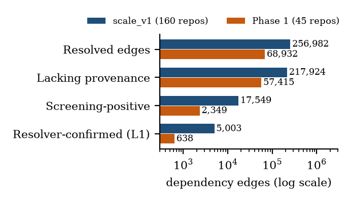
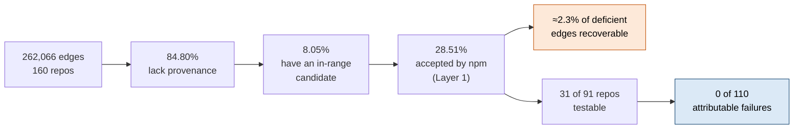
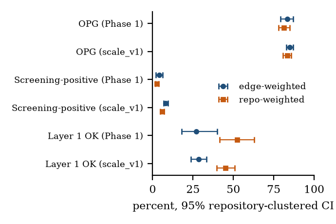
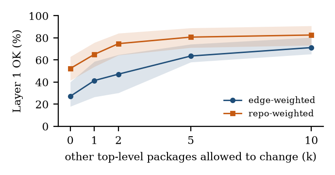
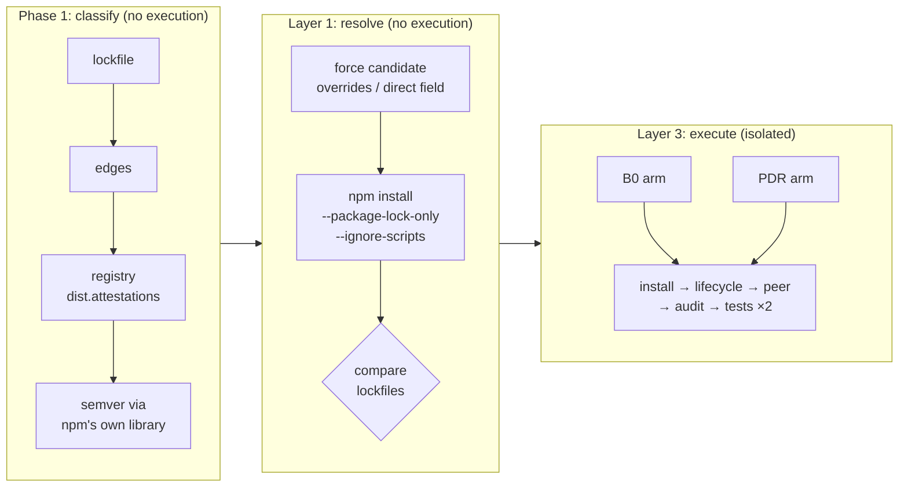
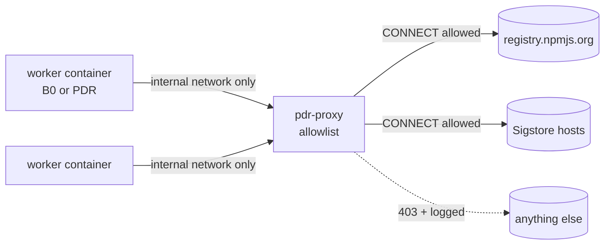

<div align="center">

# PDR: Provenance Debt at Resolution

**How much missing npm build provenance can a project recover just by choosing a different version, and what does it cost?**


*Aakash G S · Hariharan J P · Jaswanth Raj*<br>
*Department of Computer Science and Business Systems, SRM Institute of Science and Technology, Chennai, India*

[Paper (PDF)](paper/main.pdf) · [Project guide](docs/PROJECT_GUIDE.md) · [Scale-up results](docs/phase4_results.md) · [Claims registry](docs/claims.json)

</div>

---

## TL;DR

> On **160** randomly sampled, commit-pinned GitHub projects (**262,066** dependency edges):
> **84.80%** of resolved npm dependencies lack build provenance; only **8.05%** of those have a
> provenance-bearing version inside the declared range; and only **28.51%** of *those* are accepted
> by npm's own resolver without moving any other package. **About 2.3% of the missing provenance
> is recoverable by version choice.**
>
> But once npm accepts a candidate, switching to it caused **0 attributable failures in 110
> isolated experiments** (install, lifecycle scripts, peer dependencies, signature audit, the
> project's own tests).
>
> **The bottleneck is availability and resolution, not breakage.**

Provenance is **origin evidence, never a safety claim**. A package with provenance can still be buggy or malicious; this project never says otherwise (enforced by `tests/test_no_safety_claims.py`).

---

## The funnel

<p align="center">
  
</p>



*Brackets are 95% repository-clustered bootstrap CIs (5,000 resamples). Every number on this page is recomputed from raw data by `scripts/check_claims.py`.*

---

## Key results

### Two corpora, same story

| Stage | Phase 1 (45 repos) | scale_v1 (160 repos) |
|---|---|---|
| Resolved edges | 69,692 | 262,066 |
| Lacking provenance (OPG) | 83.29% [79.3, 87.0] | **84.80%** [82.7, 87.0] |
| Screening-positive among deficient | 4.09% [2.0, 6.3] | **8.05%** [6.7, 9.4] |
| Layer 1 OK, edge-weighted | 27.16% [18.0, 40.1] | **28.51%** [23.8, 33.3] |
| Layer 1 OK, repo-weighted | 52.3% [41.5, 63.0] | **45.2%** [39.8, 50.8] |

<p align="center">
  
</p>

### Why candidates fail: ripple, not refusal

| Layer 1 outcome | Phase 1 | scale_v1 |
|---|---:|---:|
| `OK` (applied, nothing else changed) | 638 | 5,003 |
| `RIPPLE` (applied, other packages moved) | 1,656 | 10,860 |
| `PEER_CONFLICT` (`ERESOLVE`) | 55 | 1,573 |
| `RESOLUTION_FAIL` | 0 | 113 |

**Trying older versions doesn't help:** retrying up to 5 lower provenance-bearing versions for 1,711 failed Phase 1 edges recovered **12**. The exists-any rate is **27.67%**, compared with 27.16% for the single best candidate.

**The definition of "no side effects" matters** (sensitivity analysis, Phase 1):

<p align="center">
  
</p>

| Other packages allowed to change (k) | 0 | 1 | 2 | 5 | 10 |
|---|---:|---:|---:|---:|---:|
| Edge-weighted OK | 27.16% | 41.42% | 47.21% | 63.60% | 71.22% |
| Repo-weighted OK | 52.3% | 65.1% | 74.8% | 80.7% | 82.6% |

### Behaviour (Layer 3, scale_v1)

| | |
|---|---|
| Projects screened (B0 only) | 91 |
| Testable (own tests pass twice in the sandbox) | **31** (34.1%, Wilson [25.2, 44.3]) |
| Experiments run | 110 |
| Outcomes | 97 `OK`, 12 `LIFECYCLE_FAIL`*, 1 `TEST_FAIL`** |
| **Attributable failures** (PDR fails where B0 passed) | **0**: install 0/110, lifecycle 0/110, tests 0/108 |
| Upper bound (rule of three) | ~2.8% per experiment, ~10% per project |
| Verified attestations increased | 99 of 110 |

\* identical failure on the unmodified baseline (blocked post-install downloads, a binary build) ·
\*\* in a project whose baseline tests weren't reproducible

---

## How it works



### Isolation for untrusted code



Every worker is **disposable** and runs with `--cap-drop=ALL`, `no-new-privileges`, a read-only root filesystem, a non-root UID, memory/CPU/PID limits, the project snapshot mounted read-only, and **no credentials or Docker socket**. `orchestrate.py` validates each `docker run` command against this spec before executing it, and a **network self-test** must pass first: allowed hosts reachable, others refused *and* logged, direct egress impossible. Layer 3 runs on throwaway GitHub-hosted runners as **20 parallel jobs**.

---

## Scientific integrity

| Practice | Where |
|---|---|
| Designs frozen in git **before** each run | tags `freeze/layer1-alt-v1`, `freeze/phase3-worker-v1..v3`, `freeze/scale-v1-design`, `freeze/scale-v1-manifest` |
| Changes only as dated amendments, reasons stated before outcomes | `docs/phase2_protocol.md`, `docs/phase3_protocol.md`, `docs/phase4_protocol.md` |
| Every published number recomputed from raw data | `docs/claims.json` + `scripts/check_claims.py` (a test) |
| Paper numbers generated, never typed | `scripts/make_figures.py` → `paper/numbers.tex` |
| Outcome-blind cohort selection, hash-locked manifests | `configs/experiments/*_manifest.{json,sha256}` |
| Both estimands with clustered CIs | `pdr/stats.py` |
| Only opened sources cited | `docs/literature_matrix.md` |
| Bugs found are documented, not hidden | `docs/PROJECT_GUIDE.md` §12 |

---

## Repository layout

```
pdr/                  core library: resolve, provenance, policy, semver, sandbox, phase3, stats
isolated_worker/      Dockerfile, proxy allowlist, orchestrator, in-container runner
scripts/              pipelines, reports, claims check, figure generation
configs/experiments/  corpora, frozen manifests (+SHA-256), commit pins
results/              raw inputs and processed results (JSONL + summaries)
docs/                 protocols, results, literature matrix, claims registry, project guide
paper/                IEEE conference paper (LaTeX), figures, PDF
tests/                122 tests
.github/workflows/    Layer 3 (micro-pilot + parallel scale-up), paper build
```

## Reproduce

```bash
pip install -r requirements.txt && npm install --ignore-scripts
python -m pytest tests -q          # 122 tests
python scripts/check_claims.py     # every registered number vs the raw data
python scripts/scale_report.py     # scale_v1 analysis
python scripts/make_figures.py     # figures, tables, paper numbers
```

Data collection: `scripts/scale_select_corpus.py` (needs `GITHUB_TOKEN` in the environment),
`fetch_corpus.py`, `check_provenance.py`, `scale_layer1.py` (npm 10.9.7).
Layer 3: manual dispatch of `.github/workflows/layer3_scale.yml`. **Never run studied code on a personal machine.**

## Documentation

| Document | Contents |
|---|---|
| [`docs/PROJECT_GUIDE.md`](docs/PROJECT_GUIDE.md) | Plain-language guide to every component, plus likely review questions |
| [`docs/phase4_protocol.md`](docs/phase4_protocol.md) / [`phase4_results.md`](docs/phase4_results.md) | Scale-up design and results |
| [`docs/phase3_protocol.md`](docs/phase3_protocol.md) / [`phase3_micropilot_results.md`](docs/phase3_micropilot_results.md) | Isolation design and micro-pilot (v1–v3) |
| [`docs/phase2_layer1_results.md`](docs/phase2_layer1_results.md) / [`phase2_layer1_alt_results.md`](docs/phase2_layer1_alt_results.md) | Layer 1, ripple sensitivity, lower-version retry |
| [`docs/literature_matrix.md`](docs/literature_matrix.md) | Related work (verified sources only) |

## Limitations

Registry state is read today, not at publish time. The corpora are popular, active GitHub projects with committed lockfiles, not the whole npm ecosystem. Layer 3 covers only the 34% of projects whose own tests run reproducibly in a locked-down sandbox. Zero observed failures is an upper bound (~3%), not proof of zero. The no-ripple definition is deliberately strict.

## Acknowledgment

The authors used Claude (Anthropic) to help build the data-collection and analysis pipeline. All code, data and results were reviewed and verified by the authors.

---

<sub>License: to be decided before public release (TASKS.md T13).</sub>
